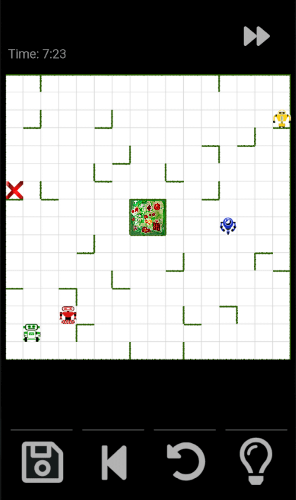

Roboyard
==========

A simple but challenging Android puzzle game inspired by the board game "Ricochet Robots ©". It includes an artificial intelligence capable of solving the puzzles.

You control four robots in a yard full of hedges, that block their way. The goal is to guide a particular robot to its destination. The robots move until they either hit a hedge or another robot.

The special feature of this app is the automatic solution finding algorithm, which can show you hints and also the optimal solution.

Roboyard allows to record up to 35 different maps. So if during your games you encounter an interesting map, save it to play it later again!

# Download App
- clone this Repository and open it with android-studio to build the app
- download a compiled version from the releases: https://github.com/rubo77/Roboyard/releases/
  - minimum Android Version: 4.4 (KITKAT)
  - The last version for Android<4.4: Roboyard version 10.1
- [download from Play Store](https://play.google.com/store/apps/details?id=de.z11.roboyard)

# Screenshot

# Difficulty
- Beginner
  - show any puzzles with solutions with at least 4-6 moves
- Advanced
  - ssolutions with at least 6-8 moves
  - keep initial playing field when starting the next game
  - keep playing field when loading a saved game
  - three lines allowed in the same row/column
  - no multi-color target
- Insane mode
  - solutions with at least 10 moves
  - five lines allowed in the same row/column
- Impossible mode
  - solutions with at least 17 moves
  - five lines allowed in the same row/column

# Build in Android Studio
- ensure you have at least 2GB of free space in your home partition
- Install Android Studio (easy with `sudo snap install --classic android-studio`)
- choose all standard and next at the end of the setup choose to import project (Gradle)
- if you get any error while syncing the project, click on the links next to the
  error and accept to download the missing components/add repositories and do refactor
- choose build → APK from the build menu

# Licence
The solver algorithm implementation is developed at [DriftingDroids](https://github.com/smack42/DriftingDroids), which is released under **GNU GPL**. Therefore Roboyard is distributed under the same [Licence](LICENCE).

# Development
Roboyard was developed in the Project EI 4 AGI: http://perso-laris.univ-angers.fr/~projetsei4/1415/P2/index.html

### Report
Download the report that was made for the university project:
http://perso-laris.univ-angers.fr/~projetsei4/1415/P2/documents/Bouncing_sphere.pdf

### Presentation
Download the slides used to present the project:
http://perso-laris.univ-angers.fr/~projetsei4/1415/P2/documents/Bouncing_sphere.pptx
